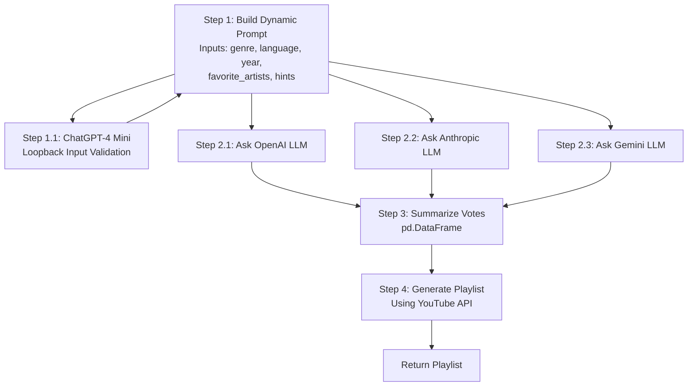

# Musicology

The goal of the app is to provide music recommendations powered by not one, but ensemble of three LLMs from popular providers:

- OpenAI,
- Anthropic,
- Google.

Similar to music competitions those three LLMs vote for recommendations and assign points to the songs. Afterwards they are
added up and the songs with the highest points across all LLMs are recommended to the user.

# Tech stuff

App is implemented using **langgraph** framework with following simple graph.



# Installation

1. Clone the repository
   ```
   gh repo clone markoo26/musicology
   ```
   
2. Setup venv and install dependencies
    ```
   uv venv
   venv activate
   uv pip install .
   ```

3. Setup environment variables for LLM providers. Refer to `.env.example` for required variables.
4. Setup `client_secrets.json` to access the Youtube API.
5. Run python script
   ```
   uv run python main.py
   ```

# DEBUGGING

After each run the intermediate recommendation files are stored in `model_outputs/{current_time}` folder.
To inspect the use `preview_recommendations.py` script 

Usage:

    uv run src/python preview_recommendations.py <file_path>

Examples:

    uv run python src/preview_recommendations.py model_outputs/2024_01_15_10_30_45/anthropic_response.json
    uv run python src/preview_recommendations.py model_outputs/2024_01_15_10_30_45/final_recommendations_df.csv

# TODO
1. Use search tools instead of creating some random titles
