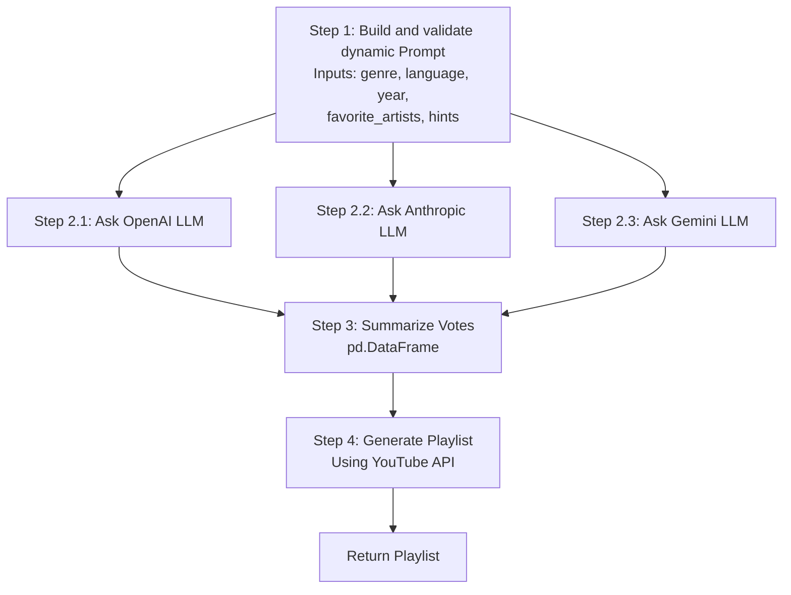

# Musicology

The goal of the app is to provide music recommendations powered by not one, but ensemble of three LLMs from popular providers:

- OpenAI,
- Anthropic,
- Google.

Similar to music competitions those three LLMs vote for recommendations and assign points to the songs. Afterwards they are
added up and the songs with the highest points across all LLMs are recommended to the user.

# Tech stuff

App is implemented using langgraph framework with following simple graph.

# TODO
1. Use search tools instead of creating some random titles
2. 